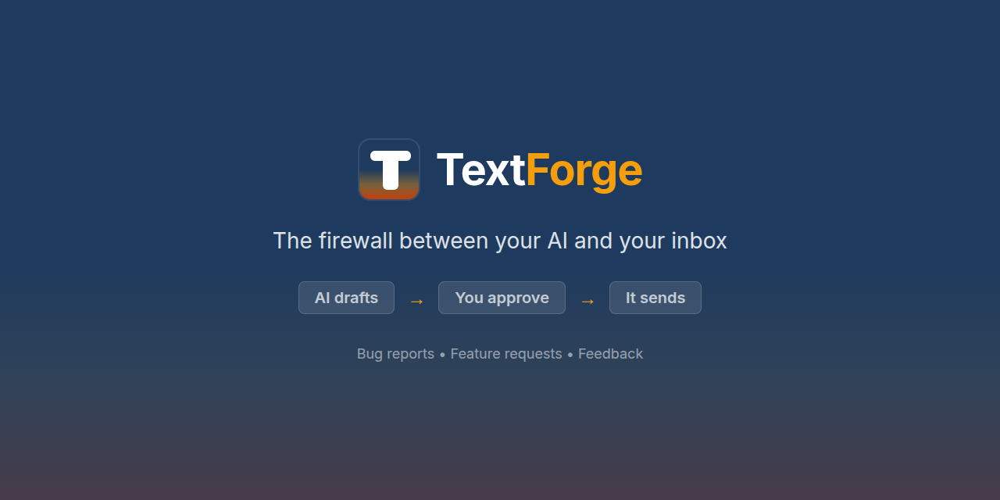

  

<h1 align="center">TextForge Feedback</h1>

  <strong>Bug reports, feature requests, and feedback for <a href="https://textforge.net">TextForge</a></strong> 
  The safety layer for AI email. AI drafts, you approve, then it sends.

  <a href="https://textforge.net">Website</a> &bull;
  <a href="https://x.com/ForgeT34326">Twitter</a> &bull;
  <a href="https://github.com/textforge-app">GitHub</a>

---

## How to Submit Feedback

- **Found a bug?** [Open a bug report](https://github.com/textforge-app/feedback/issues/new?template=bug_report.md)
- **Have an idea?** [Request a feature](https://github.com/textforge-app/feedback/issues/new?template=feature_request.md)
- **General question?** [Ask a question](https://github.com/textforge-app/feedback/issues/new?template=question.md)

## What is TextForge?

TextForge is an email approval gateway — AI agents draft emails, humans review and approve them before anything sends. It's the safety layer between your AI and your inbox.

**How it works:**

1. Your AI drafts an email
2. The draft goes to your TextForge approval queue
3. You review, edit, approve, or reject
4. Only approved emails actually send — from your own Gmail account

Learn more at [textforge.net](https://textforge.net).
